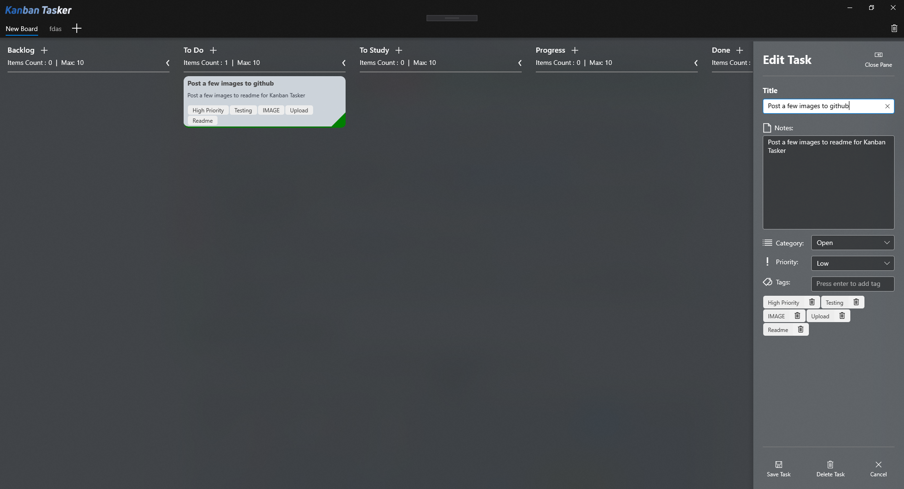
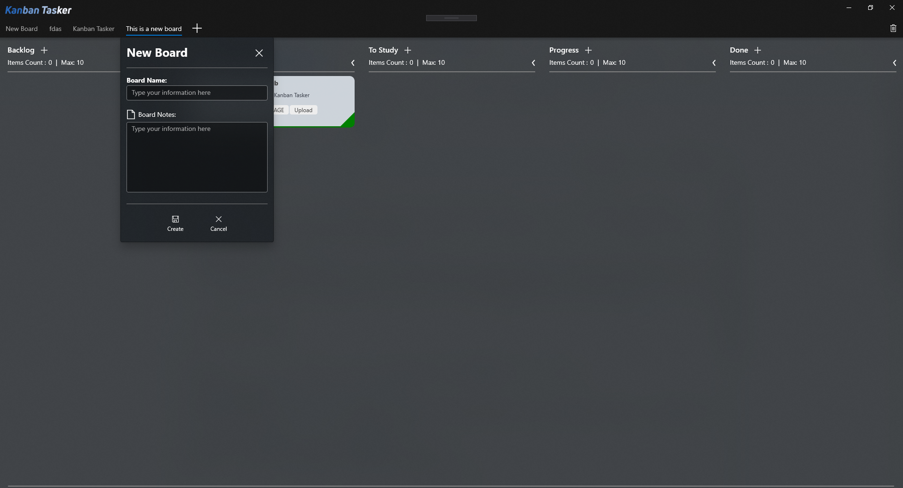
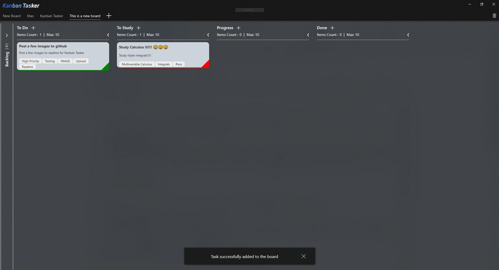
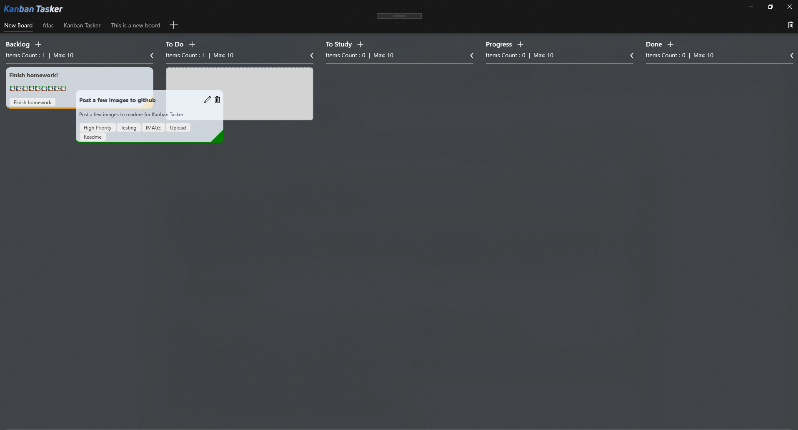

# Kanban Tasker

This Universal Windows Platform (UWP) application uses a Kanban Board to create a workflow for multiple projects, tasks, etc.

Initial purpose of this application was to track progress on multiple projects and homework for college, but have made it into more of a *general* Kanban Board so that others are able to use it!

## Kanban Tasker Details

Created with C#/XAML and the Universal Windows Platform. The UI is created with Extensible Application Markup Language (XAML) and backend is using C#. 

Uses a kanban UI control created by [Syncfusion](https://www.syncfusion.com) but fully customized to Kanban Taskers style (see corresponding data templates in *BoardView.xaml*). Also implemented with a Sqlite database to store the tasks/boards and uses create, read, update, and delete (CRUD) operations against the data (For information on viewing the database created by sqlite, look at [Getting Started](#getting-started))

Old designs from the start of the app can be found in: **KanbanTasker/Images/OLD_....**

#### Simple design with a popout pane to edit and create your tasks
 * Quick access to pane comes from hovering over the task and selecting the edit icon
   * **Note:** Tablet users need to touch and hold the task for a context menu to show (Right-click is enabled for desktop/laptop users too)
 * Tags in the pane can range in width and height. If the tag is longer than the width of the pane, it will wrap to a new row and  increase the height

#### Card design for tasks
  * Hover over a task to view the edit and delete buttons
  * Priority indicator has three options as of now: Low (Green), Medium (Yellow), High (Red)
  * Mouse reveal effect added to the bottom priority indicator border
  * Cards can vary in width and height. Wrapping added to card tags as well 

#### Support for multiple boards to make different uses out of each board:
  * Additional features planned

#### Ability to collapse columns
  * Support to collapse columns added so you're able to focus on the important tasks at hand
  * Includes in app notifications to indicate whether your insertion, deletion, or update was successfull or not

#### Ability to drag cards across columns for easy workflow structure
  * Columns support multiple categories per column. For instance, the 'Done' column has categories *Review* and *Done*, which you will see when dragging to a column that has multiple categories 
    * Able to see the categories for the current column in the pane too

## Getting Started

### Debugging

The program requires a license from Syncfusion since the Kanban Control is a control used by them, but they provide a free community license here: https://www.syncfusion.com/products/communitylicense

Essentially, generate a key for the UWP controls and head to App.xaml.cs and add your key into the string "YOUR_API_KEY". 

### Database generated by sqlite

You can view the .db file generated by sqlite with https://sqlitebrowser.org/

* The database file, .db, will be located in your ***Users->AppData (Make sure hidden items is on)->Local->Packages->(Search for db name)***
  * The database name is **kanbantaskerdb.db**
  * All database work is handled and located located in *DataProvider.cs*
* Sqlite Browser should open automatically to your user profile. Navigate to View and select the checkbox to view ***Hidden Items*** so that App Data will show (if not showing already)

### Known Bugs

Two bugs have been found and reported to Syncfusion: 
  * **1st:** Bug occurs while dragging card to new column and trying to update it's data in the observable collection and database on *Card_DragEnd*. Also, after a several tasks created and you drag to same column or just drag to others, it starts to reorder the cards and crashes. 
  * **2nd:** Bug occurs when adding new task to a column, dragging to a new column, then trying to delete (could be related to the first bug, but the exception is a bit different)
    * The program breaks saying "Object reference not set to an instance of an object." but the model is initialized and has data. The object is actually *removed* from the collection as it should be, but stack trace shows an issue with a call in Syncfusion.UI.Xaml.Kanban
    * Works as expected when deleting from task created in the column it was created in

### Prerequisites

Due to the requirements for certain Windows 10 effects and controls used, the minimum version required to debug and run the application is **1809**

Minimum version: Windows 10, Version 1809

Target Version: Windows 10, Version 1903

#### Nuget Packages Required:

* Microsoft Sqlite should be installed on your system by default. So, the nuget package *"Microsoft.Data.Sqlite"* or *"Microsoft.Data.Sqlite.Core"* will work 

* *SQLitePCLRaw.bundle_winsqlite3* 

* *Syncfusion.SfKanban.UWP* package should be installed

* Tutorial on these installations can be found on microsoft docs here: https://docs.microsoft.com/en-us/windows/uwp/data-access/sqlite-databases

## Built With

* [Universal Windows Platform](https://developer.microsoft.com/en-us/windows/apps) - The desktop framework used
* [Syncfusion for UWP Kanban Board](https://www.syncfusion.com/uwp-ui-controls/kanban-board) - UI Kanban Board used
* [Sqlite - Started with tutorial by Microsoft](https://docs.microsoft.com/en-us/windows/uwp/data-access/sqlite-databases) - Database Framework 

## Contributing

[Coming Soon]

## Authors

* **Hunter** - *Initial work* - [hjohnson012](https://github.com/hjohnson012)

See also the list of [contributors](https://github.com/hjohnson12/KanbanTasker/graphs/contributors) who participated in this project.

## License

This project is licensed under the MIT License - see the [LICENSE.md](LICENSE.md) file for details
